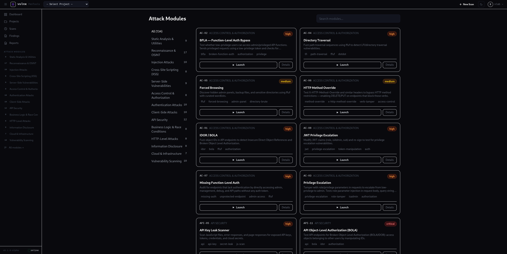
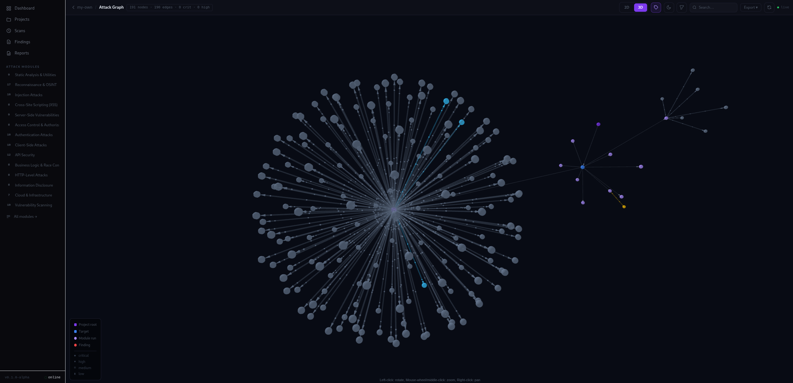

# PenTools

**PenTools** is a self-hosted, web-based penetration testing platform built on Django 5.1, Celery, Django Channels, and PostgreSQL. It provides 135 security testing modules covering every major OWASP category — including native OWASP ZAP integration for spider, passive, and active scanning — a real-time scan console over WebSocket, structured finding management with CVSS 3.1 scoring, professional PDF/HTML report generation, and an interactive attack graph per project.

---

## Table of Contents

- [Overview](#overview)
- [Attack Module Interface](#attack-module-interface)
- [Attack Graph](#attack-graph)
- [Architecture](#architecture)
- [Prerequisites](#prerequisites)
- [Quick Start](#quick-start)
- [Default Credentials](#default-credentials)
- [Project Structure](#project-structure)
- [Module System](#module-system)
- [All Modules — 132 total](#all-modules--132-total)
- [User Workflow](#user-workflow)
- [REST API Reference](#rest-api-reference)
- [Environment Variables](#environment-variables)
- [Running Tests](#running-tests)
- [Production Deployment](#production-deployment)
- [Sprint History](#sprint-history)

---

## Overview

PenTools provides a browser-based interface for launching and managing penetration tests against web applications, APIs, and infrastructure. Every scan is executed asynchronously via a Celery worker and streamed back to the operator in real time via WebSocket.

Core capabilities:

- 135 attack modules across 14 categories (authentication, injection, XSS, reconnaissance, API, cloud, and more), including 3 native OWASP ZAP modules
- Real-time scan output streamed over WebSocket to a live log console
- Per-finding status tracking with CVSS 3.1 scoring, duplicate detection, and triage workflow
- Professional six-section report builder (Executive Summary, Methodology, Scope of Work, Findings Summary, Detailed Findings, WSTG v4.2 Playbook) exported as HTML or PDF
- Telegram and Slack notifications on scan completion and critical findings
- Interactive attack graph per project rendered with Cytoscape.js
- REST API and API key authentication for CI/CD integration
- Celery Flower dashboard for worker monitoring

---

## Attack Module Interface

The module execution interface provides a structured parameter form, real-time log streaming, and a findings summary on completion.



---

## Attack Graph

The interactive attack graph visualises relationships between targets, scan jobs, and findings within a project.



---

## Architecture

```
Browser                       Django (ASGI / Uvicorn)
  |                                |
  |-- HTTP (HTMX, forms) ------->  |-- pentools/urls.py
  |-- WebSocket (live logs) ---->  |-- apps/scans/consumers.py
                                   |
                                   |-- PostgreSQL  (primary database)
                                   |-- Redis       (broker + cache + channel layer)
                                   |-- Celery      (async task execution)
                                   |-- Nginx       (TLS termination + static files)
```

Services defined in `docker-compose.yml`:

| Service        | Image / Build         | Purpose                                  |
|----------------|-----------------------|------------------------------------------|
| `web`          | `./web/Dockerfile`    | Django ASGI server (Uvicorn)             |
| `db`           | `postgres:16-alpine`  | Primary PostgreSQL database              |
| `redis`        | `redis:7-alpine`      | Celery broker, cache, channel layer      |
| `celery`       | `./web/Dockerfile`    | Scan task worker                         |
| `celery_beat`  | `./web/Dockerfile`    | Periodic task scheduler                  |
| `flower`       | `./web/Dockerfile`    | Celery monitor (port 5555)               |
| `zap`          | `ghcr.io/zaproxy/zaproxy:stable` | OWASP ZAP daemon (API port 8080) |
| `tools`        | `./tools/Dockerfile`  | Installs pentest binaries into a volume  |
| `nginx`        | `nginx:1.26-alpine`   | Reverse proxy (ports 80 / 443)           |

---

## Prerequisites

- Docker 24 or later
- Docker Compose v2 (`docker compose` command)
- A domain or IP address pointing to the host (for HTTPS in production)

---

## Quick Start

### 1. Clone and configure

```bash
git clone https://github.com/vulnx/pentools.git
cd pentools

cp .env.example .env
# Edit .env and set at minimum:
#   DJANGO_SECRET_KEY
#   POSTGRES_PASSWORD
#   FIELD_ENCRYPTION_KEY
```

Generate the required key values:

```bash
# DJANGO_SECRET_KEY
python -c "import secrets; print(secrets.token_urlsafe(50))"

# FIELD_ENCRYPTION_KEY
python -c "from cryptography.fernet import Fernet; print(Fernet.generate_key().decode())"
```

### 2. Build and start

```bash
docker compose up --build -d
```

The first run builds all images and installs pentest tool binaries into a shared Docker volume. Allow 5 to 15 minutes on the initial launch.

### 3. Apply migrations and create a superuser

```bash
docker compose exec web python manage.py migrate
docker compose exec web python manage.py createsuperuser
```

### 4. Open the application

Navigate to `http://localhost` (or your configured hostname) and log in with the superuser credentials created above.

---

## Default Credentials

No default credentials are shipped. The first superuser is created manually with the `createsuperuser` command above.

The admin panel is available at `/admin-panel/`. Access requires `is_staff=True`.

---

## Project Structure

```
PenTools/
  docker-compose.yml              # All service definitions
  .env.example                    # Environment variable template
  nginx/
    nginx.conf                    # Nginx reverse proxy configuration
  tools/
    Dockerfile                    # Builds pentest tool binaries
  web/                            # Django application root
    manage.py
    Dockerfile
    requirements.txt
    pentools/                     # Django project package
      settings/
        base.py                   # Shared settings
        development.py            # Development overrides (DEBUG=True)
        production.py             # Production overrides (HTTPS, HSTS)
      urls.py                     # Root URL configuration
      celery.py                   # Celery application initialisation
      asgi.py                     # ASGI entry point (HTTP + WebSocket)
    apps/
      accounts/                   # Custom User model, login/logout, API key auth
      targets/                    # Projects and Targets
      modules/                    # Module registry, BaseModule, FieldSchema
      scans/                      # ScanJob, ScanLog, Celery executor, WS consumer
      results/                    # Finding, FindingStatusHistory, CVSS calculator
      reports/                    # Report, builder, PDF/HTML export (WSTG playbook)
      notifications/              # NotificationChannel, Telegram/Slack dispatch
      graph/                      # Attack graph (Cytoscape.js + WebSocket)
      recon/                      # R-* modules (17 modules)
      injection/                  # I-* modules (10 modules)
      xss_modules/                # X-* modules (8 modules)
      server_side/                # SS-* modules (9 modules)
      access_control/             # AC-* modules (8 modules)
      auth_attacks/               # AUTH-* modules (10 modules)
      client_side/                # CS-* modules (10 modules)
      api_audit/                  # API-* modules (12 modules)
      business_logic/             # BL-* modules (8 modules)
      http_attacks/               # H-* modules (8 modules)
      disclosure/                 # D-* modules (8 modules)
      cloud/                      # C-* modules (5 modules)
      vuln_scan/                  # V-* modules (10 modules)
      static_tools/               # S-* modules (9 modules)
    templates/                    # Django templates
    static/
      img/
        Attack_Module.png
        AttackGraph.png
    tests/
      test_integration_flow.py    # Full integration test suite (14 test classes)
```

---

## Module System

### BaseModule

All attack modules inherit from `apps.modules.engine.BaseModule`. The minimum required implementation is:

```python
from apps.modules.engine import BaseModule, FieldSchema

class MyModule(BaseModule):
    id          = "CATEGORY-NN"
    name        = "Human-Readable Name"
    category    = "injection"
    risk_level  = "high"           # critical | high | medium | low | info
    description = "What this module does."

    PARAMETER_SCHEMA = [
        FieldSchema(
            key="target_url",
            label="Target URL",
            field_type="url",
            required=True,
            help_text="The URL to test.",
        ),
    ]

    def execute(self, params: dict, job_id: str, stream) -> dict:
        url = params["target_url"]
        stream("info", f"Testing {url}...")
        # ... scan logic ...
        return {
            "status": "done",
            "findings": [...],
            "raw_output": "...",
        }
```

The `execute()` method receives validated `params`, the `job_id` string, and a `stream(level, message)` callable that pushes log lines to the WebSocket console in real time.

### Module Auto-Discovery

The `ModuleRegistry` singleton discovers all modules at startup by importing every `apps/*/modules.py` file. No explicit registration is required — any class that inherits `BaseModule` with a valid `id` attribute is registered automatically.

### FieldSchema Properties

| Property      | Default   | Description                                               |
|---------------|-----------|-----------------------------------------------------------|
| `key`         | required  | URL-safe parameter name used in the params dict           |
| `label`       | required  | Human-readable field label                                |
| `field_type`  | `"text"`  | Input type: `text`, `url`, `password`, `number`, `select`,|
|               |           | `multiselect`, `checkbox`, `textarea`, `file_upload`,     |
|               |           | `json_editor`, `code_editor`, `toggle`, `radio`           |
| `required`    | `False`   | Whether the field must have a non-empty value             |
| `default`     | `None`    | Default value pre-populated in the form                   |
| `placeholder` | `""`      | Placeholder text shown in empty inputs                    |
| `help_text`   | `""`      | Description shown below the field                        |
| `options`     | `[]`      | List of `{"value": ..., "label": ...}` for select/radio  |
| `sensitive`   | `False`   | Mask in logs and DB (passwords, tokens)                   |
| `group`       | `"basic"` | `"basic"` or `"advanced"` collapsible group               |

### Module Categories

| Category        | Prefix  | Description                                            |
|-----------------|---------|--------------------------------------------------------|
| Authentication  | AUTH    | JWT, OAuth2, SAML, session management, brute force     |
| Injection       | I       | SQL, NoSQL, LDAP, command injection, SSTI              |
| XSS             | X       | Reflected, Stored, DOM, Blind, WAF bypass              |
| Server-Side     | SS      | SSRF, XXE, deserialisation, LFI, RFI, log poisoning    |
| Access Control  | AC      | IDOR, BFLA, privilege escalation, forced browsing      |
| Reconnaissance  | R       | Port scan, subdomain enum, SSL audit, fingerprinting   |
| Client-Side     | CS      | CSRF, CORS, clickjacking, prototype pollution          |
| API / Web Svcs  | API     | REST fuzzing, GraphQL, SOAP, gRPC, mass assignment     |
| Business Logic  | BL      | Race conditions, price manipulation, workflow bypass   |
| HTTP Attacks    | H       | Request smuggling, cache poisoning, CRLF injection     |
| Disclosure      | D       | Sensitive files, error message mining, EXIF            |
| Cloud           | C       | S3, Azure Blob, GCP, AWS metadata, Kubernetes API      |
| Vulnerability   | V       | Nuclei CVE/misconfiguration, CMS, dependency scanning  |
| Static Tools    | S       | Offline analysers: JWT decoder, header auditor, hashes |

---

## All Modules — 132 total

### Authentication — 10 modules

| ID       | Name                       |
|----------|----------------------------|
| AUTH-01  | JWT Full Attack Suite      |
| AUTH-02  | OAuth2 Vulnerability       |
| AUTH-03  | SAML Attacks               |
| AUTH-04  | Password Brute Force       |
| AUTH-05  | Credential Stuffing        |
| AUTH-06  | MFA/2FA Bypass             |
| AUTH-07  | Session Management Audit   |
| AUTH-08  | Password Reset Flaws       |
| AUTH-09  | Account Takeover Chain     |
| AUTH-10  | SSO / OIDC Abuse           |

### Injection — 10 modules

| ID    | Name                      |
|-------|---------------------------|
| I-01  | SQL Injection             |
| I-02  | NoSQL Injection           |
| I-03  | LDAP Injection            |
| I-04  | XPath Injection           |
| I-05  | Command Injection         |
| I-06  | SSTI — Template Injection |
| I-07  | HTML Injection            |
| I-08  | Email Header Injection    |
| I-09  | HTTP Parameter Pollution  |
| I-10  | XML/SOAP Injection        |

### XSS — 8 modules

| ID    | Name                  |
|-------|-----------------------|
| X-01  | Reflected XSS Scanner |
| X-02  | Stored XSS            |
| X-03  | DOM XSS Finder        |
| X-04  | Blind XSS (OOB)       |
| X-05  | mXSS — Mutation XSS   |
| X-06  | CSS Injection         |
| X-07  | XSS via File Upload   |
| X-08  | XSS WAF Bypass Lab    |

### Server-Side — 9 modules

| ID     | Name                        |
|--------|-----------------------------|
| SS-01  | SSRF                        |
| SS-02  | XXE Injection               |
| SS-03  | File Upload — RCE           |
| SS-04  | Insecure Deserialisation    |
| SS-05  | Path Traversal / LFI        |
| SS-06  | Remote File Inclusion       |
| SS-07  | Open Redirect               |
| SS-08  | SSTI to RCE                 |
| SS-09  | Log Poisoning               |

### Access Control — 8 modules

| ID     | Name                              |
|--------|-----------------------------------|
| AC-01  | IDOR / BOLA                       |
| AC-02  | BFLA — Function-Level Auth Bypass |
| AC-03  | Privilege Escalation              |
| AC-04  | Directory Traversal               |
| AC-05  | Forced Browsing                   |
| AC-06  | HTTP Method Override              |
| AC-07  | Missing Function-Level Auth       |
| AC-08  | JWT Privilege Escalation          |

### Reconnaissance — 17 modules

| ID     | Name                          |
|--------|-------------------------------|
| R-01   | Port Scanner                  |
| R-02   | Subdomain Enumeration         |
| R-03   | SSL/TLS Deep Audit            |
| R-04   | WAF & CDN Fingerprint         |
| R-05   | Tech Stack Fingerprint        |
| R-06   | DNS Full Enumeration          |
| R-07   | Certificate Transparency      |
| R-08   | Web Crawler & Sitemap         |
| R-09   | HTTP Probing                  |
| R-10   | ASN & IP Intelligence         |
| R-11   | Email Harvesting              |
| R-12   | Google Dork Automation        |
| R-13   | GitHub Recon                  |
| R-14   | Shodan / Censys Intelligence  |
| R-15   | Cloud Asset Discovery         |
| R-16   | Virtual Host Discovery        |
| R-17   | Screenshot Capture            |

### Client-Side — 10 modules

| ID     | Name                               |
|--------|------------------------------------|
| CS-01  | CSRF — Cross-Site Request Forgery  |
| CS-02  | Clickjacking                       |
| CS-03  | CORS Misconfiguration              |
| CS-04  | Prototype Pollution                |
| CS-05  | DOM Clobbering                     |
| CS-06  | PostMessage Exploitation           |
| CS-07  | WebSocket Hijacking (CSWSH)        |
| CS-08  | Subdomain Takeover                 |
| CS-09  | Tabnabbing — window.opener Audit   |
| CS-11  | CSS Exfiltration                   |

### API / Web Services — 12 modules

| ID      | Name                                  |
|---------|---------------------------------------|
| API-01  | REST API Fuzzer                       |
| API-02  | API Version Enumeration               |
| API-03  | Mass Assignment                       |
| API-04  | Rate Limit Bypass                     |
| API-05  | API Key Leak Scanner                  |
| API-06  | GraphQL Security Suite                |
| API-07  | SOAP / WSDL Audit                     |
| API-08  | WebSocket Fuzzer                      |
| API-09  | gRPC Security Audit                   |
| API-10  | JSON Web API Injection                |
| API-11  | API Object-Level Authorisation (BOLA) |
| API-12  | Swagger / OpenAPI Parser              |

### Business Logic — 8 modules

| ID     | Name                       |
|--------|----------------------------|
| BL-01  | Race Condition Engine      |
| BL-02  | Price / Value Manipulation |
| BL-03  | Workflow Step Bypass       |
| BL-04  | Limit Bypass               |
| BL-05  | Coupon / Promo Abuse       |
| BL-06  | File Upload Logic Bypass   |
| BL-07  | 2FA Race Condition         |
| BL-08  | Account & Balance Exploit  |

### HTTP Attacks — 8 modules

| ID    | Name                     |
|-------|--------------------------|
| H-01  | HTTP Request Smuggling   |
| H-02  | HTTP Response Splitting  |
| H-03  | Cache Poisoning          |
| H-04  | Web Cache Deception      |
| H-05  | Host Header Injection    |
| H-06  | HTTP Method Fuzzer       |
| H-07  | CRLF Injection           |
| H-08  | Redirect Chain Analysis  |

### Information Disclosure — 8 modules

| ID    | Name                       |
|-------|----------------------------|
| D-01  | Sensitive File Discovery   |
| D-02  | Error Message Mining       |
| D-03  | Source Code Disclosure     |
| D-04  | Backup & Archive Finder    |
| D-05  | Debug / Admin Panel Finder |
| D-06  | API Key / Token in Response|
| D-07  | Cloud Metadata Exposure    |
| D-08  | EXIF / Metadata Extractor  |

### Cloud Security — 5 modules

| ID    | Name                                |
|-------|-------------------------------------|
| C-01  | S3 Bucket Audit                     |
| C-02  | AWS Metadata Exploit (SSRF)         |
| C-03  | Azure Blob Storage Audit            |
| C-04  | GCP Metadata Service Exploit        |
| C-05  | Docker & Kubernetes API Exposure    |

### Vulnerability Scanning — 10 modules

| ID    | Name                              |
|-------|-----------------------------------|
| V-01  | Nuclei — CVE Scan                 |
| V-02  | Nuclei — Misconfiguration Scan    |
| V-03  | Nuclei — Web Templates Scan       |
| V-04  | Nuclei — API Security Scan        |
| V-05  | Nuclei — Network & Service Scan   |
| V-06  | Nuclei — Custom YAML Template     |
| V-07  | CMS Vulnerability Scanner         |
| V-08  | Dependency Vulnerability Scanner  |
| V-09  | Default Credentials Tester        |
| V-10  | CVE PoC Auto-Matcher              |

### OWASP ZAP Integration — 3 modules

| ID      | Name                              |
|---------|-----------------------------------|
| ZAP-01  | ZAP — Spider & URL Discovery      |
| ZAP-02  | ZAP — Passive Audit               |
| ZAP-03  | ZAP — Active Audit                |

### Static / Offline Tools — 9 modules

| ID    | Name                       |
|-------|----------------------------|
| S-01  | HTTP Request Analyzer      |
| S-02  | JWT Decoder & Attacker     |
| S-03  | Security Header Auditor    |
| S-04  | JS Secret Scanner          |
| S-05  | Regex / Payload Lab        |
| S-06  | Encoding / Decoding Studio |
| S-07  | Hash Analyzer              |
| S-08  | TLS Certificate Inspector  |
| S-09  | HTTP Diff Comparator       |

---

## User Workflow

### 1. Create a Project

Navigate to **Targets** in the sidebar and click **New Project**. Every scan, finding, and report is scoped to a project.

### 2. Add Targets

Inside the project, click **Add Target**. Provide a name, type (URL, domain, IP, or CIDR), and value. Targets are linked to scans for correlation in the attack graph and report scope.

### 3. Browse Modules

Navigate to **Modules** in the sidebar. Filter by category or search by module name or ID. Each module card shows the risk level, description, and a **Launch** button.

### 4. Configure and Launch a Scan

Clicking **Launch** opens the parameter form. Fill in required fields, expand **Advanced Options** for optional parameters, and optionally save the configuration as a named template. Click **Launch Scan**.

### 5. Monitor Scan Progress

The scan detail page shows a live console receiving log lines via WebSocket. A progress bar and status badge update in real time. The cancel button is available while the scan is `pending` or `running`.

### 6. Review Findings

After the scan completes, findings appear in the **Findings** tab on the scan detail page and in the global **Findings** list. Each finding displays severity, CVSS score, URL, evidence, and remediation guidance. Update the status (open, confirmed, false positive, fixed) to manage the triage workflow.

### 7. Generate a Report

Navigate to **Reports** and click **New Report**. Select the project, set engagement parameters (engagement type, methodology notes, scope notes), add an executive summary, and choose the minimum severity to include. Export as HTML or PDF. The generated report contains six sections:

1. Executive Summary — severity distribution and risk overview
2. Testing Methodology — executed modules mapped to WSTG v4.2 references
3. Scope of Work — assessed targets with in-scope/out-of-scope designation
4. Findings Summary — consolidated findings table
5. Detailed Findings — per-finding cards with CVSS v3.1, CVE/NVD links, evidence, and recommendations
6. WSTG v4.2 Playbook — full testing checklist with coverage status

### 8. Set Up Notifications

Navigate to **Notifications** and create a channel (Telegram or Slack). Link it to a project and choose which events trigger alerts (scan complete, critical finding).

---

## REST API Reference

### Authentication

Two authentication methods are supported:

**Session authentication** — standard Django session cookie set after logging in through the web UI.

**API key authentication** — include the header `X-API-Key: <your-key>` on every request. Regenerate your key from the profile page.

All endpoints require authentication. Unauthenticated requests receive `302 Redirect` (session) or `403 Forbidden` (API key).

### Scan Endpoints

| Method | Path                                       | Description                                    |
|--------|--------------------------------------------|------------------------------------------------|
| GET    | `/api/v1/scans/<job-id>/status/`           | Job status, progress, finding counts           |
| GET    | `/api/v1/scans/<job-id>/logs/`             | Log lines (supports `?since=<log-id>` cursor)  |
| GET    | `/api/v1/scans/<job-id>/findings/`         | Findings attached to this scan job             |
| GET    | `/api/v1/scans/configs/<module-id>/`       | List saved parameter configs for a module      |
| POST   | `/api/v1/scans/configs/<module-id>/save/`  | Save or overwrite a named config               |
| POST   | `/api/v1/scans/configs/delete/<id>/`       | Delete a saved config                          |

**Job status response:**

```json
{
  "id": "3fa85f64-5717-4562-b3fc-2c963f66afa6",
  "status": "done",
  "progress": 100,
  "finding_count": 3,
  "critical_count": 1,
  "high_count": 2,
  "duration": 47
}
```

**Log lines response:**

```json
{
  "logs": [
    { "id": 1001, "level": "info",  "message": "Starting JWT attack suite", "ts": "2025-01-01T12:00:00Z" },
    { "id": 1002, "level": "warn",  "message": "alg:none accepted — token forgeable", "ts": "2025-01-01T12:00:01Z" }
  ]
}
```

### Module Endpoints

| Method | Path               | Description                              |
|--------|--------------------|------------------------------------------|
| GET    | `/api/v1/modules/` | List all registered modules with schema  |

### WebSocket Channels

| Path                               | Description                                 |
|------------------------------------|---------------------------------------------|
| `ws://<host>/ws/scan/<job-id>/`    | Live scan log stream for a specific job     |
| `ws://<host>/ws/graph/<proj-id>/`  | Real-time attack graph updates              |

---

## Environment Variables

Copy `.env.example` to `.env` before running. Required variables must be set before the first `docker compose up`.

| Variable                 | Required | Default                  | Description                                       |
|--------------------------|----------|--------------------------|---------------------------------------------------|
| `DJANGO_SECRET_KEY`      | Yes      | —                        | Django secret key (50+ character random string)   |
| `DJANGO_DEBUG`           | No       | `False`                  | Set `True` for local development only             |
| `DJANGO_ALLOWED_HOSTS`   | No       | `localhost,127.0.0.1`    | Comma-separated allowed hostnames                 |
| `CSRF_TRUSTED_ORIGINS`   | No       | auto-derived             | Comma-separated trusted CSRF origins              |
| `POSTGRES_DB`            | Yes      | `pentools`               | PostgreSQL database name                          |
| `POSTGRES_USER`          | Yes      | `pentools`               | PostgreSQL username                               |
| `POSTGRES_PASSWORD`      | Yes      | —                        | PostgreSQL password                               |
| `POSTGRES_HOST`          | No       | `db`                     | PostgreSQL host (Docker service name)             |
| `POSTGRES_PORT`          | No       | `5432`                   | PostgreSQL port                                   |
| `REDIS_URL`              | No       | `redis://redis:6379/0`   | Redis connection URL                              |
| `CELERY_BROKER_URL`      | No       | `redis://redis:6379/0`   | Celery broker URL                                 |
| `CELERY_RESULT_BACKEND`  | No       | `redis://redis:6379/1`   | Celery result backend URL                         |
| `CELERY_MAX_CONCURRENCY` | No       | `20`                     | Maximum Celery worker concurrency                 |
| `FIELD_ENCRYPTION_KEY`   | Yes      | —                        | Fernet key for encrypting sensitive scan params   |
| `FLOWER_USER`            | No       | `admin`                  | Basic auth username for Flower                    |
| `FLOWER_PASSWORD`        | Yes      | —                        | Basic auth password for Flower                    |
| `TELEGRAM_BOT_TOKEN`     | No       | —                        | Telegram bot token for notifications              |
| `SLACK_WEBHOOK_URL`      | No       | —                        | Slack incoming webhook URL for notifications      |
| `INTERACTSH_SERVER`      | No       | —                        | Self-hosted OOB/OAST callback server hostname     |
| `INTERACTSH_TOKEN`       | No       | —                        | Authentication token for the interactsh server    |
| `SHODAN_API_KEY`         | No       | —                        | Shodan API key (R-10 and R-14; also read from env)|
| `HUNTER_IO_API_KEY`      | No       | —                        | Hunter.io API key (R-11)                          |
| `GITHUB_TOKEN`           | No       | —                        | GitHub token (R-13)                               |
| `ZAP_API_URL`            | No       | `http://zap:8080`        | OWASP ZAP REST API URL (internal Docker hostname) |
| `ZAP_API_KEY`            | No       | —                        | ZAP API key — must match `api.key` in ZAP daemon  |

---

## Running Tests

### Inside the container (recommended)

```bash
# Run the full integration test suite
docker compose exec web python manage.py test tests.test_integration_flow --verbosity=2

# Run all tests
docker compose exec web python manage.py test --verbosity=2

# Run Django system checks
docker compose exec web python manage.py check
```

### Test classes

| Class                         | Coverage                                                        |
|-------------------------------|-----------------------------------------------------------------|
| `HealthCheckTestCase`         | `/health/` endpoint returns `{"status": "ok"}`                 |
| `AuthenticationTestCase`      | Login, logout, profile, API key regeneration, redirect rules    |
| `ProjectTargetTestCase`       | Project and target CRUD, uniqueness constraints                 |
| `ModuleRegistryTestCase`      | Module list/detail/filter, required field validation            |
| `ScanLifecycleTestCase`       | Scan create/detail/list/cancel/retry, access control            |
| `ScanAPITestCase`             | Status, logs, findings APIs, saved config CRUD                  |
| `FindingsTestCase`            | Finding CRUD, status update, CVSS calc, duplicate dedup         |
| `ReportsTestCase`             | Report create/detail/builder                                    |
| `NotificationsTestCase`       | Notification channel creation                                   |
| `DashboardTestCase`           | Stats accuracy, data isolation, root redirect                   |
| `ContextProcessorTestCase`    | `user_all_projects` includes owned and member projects          |
| `ScanParamValidationTestCase` | Schema serialisation, form handling without required fields     |
| `ScanTaskUnitTestCase`        | Celery task marks job failed for non-existent module            |
| `FindingModelTestCase`        | evidence_hash computation, severity badge, project inheritance  |

---

## Production Deployment

### TLS / HTTPS

Place fullchain and private key PEM files at `./ssl/fullchain.pem` and `./ssl/privkey.pem`. The provided `nginx/nginx.conf` serves HTTPS on port 443.

Set the following in `.env`:

```
DJANGO_DEBUG=False
DJANGO_ALLOWED_HOSTS=your.domain.com
CSRF_TRUSTED_ORIGINS=https://your.domain.com
```

### Collect static files

```bash
docker compose exec web python manage.py collectstatic --noinput
```

### Database backups

```bash
# Dump
docker compose exec db pg_dump -U pentools pentools > backup_$(date +%Y%m%d).sql

# Restore
cat backup_YYYYMMDD.sql | docker compose exec -T db psql -U pentools -d pentools
```

### Scaling Celery workers

```bash
# Start additional worker replicas
docker compose up --scale celery=4 -d

# Or run a worker dedicated to a specific queue
celery -A pentools worker -Q recon_queue,api_queue --concurrency=8
```

### Flower monitor

Flower is available at `http://localhost:5555`. It is bound to `127.0.0.1` only by default. If remote access is required, place it behind Nginx with authentication.

---

## Sprint History

| Sprint | Focus                                     | Modules delivered                                              |
|--------|-------------------------------------------|----------------------------------------------------------------|
| 1      | Platform foundation                       | Django project, Celery, WebSocket, User model, module registry |
| 2      | Authentication attacks                    | AUTH-01 to AUTH-09                                             |
| 3      | Injection and XSS                         | I-01..I-10, X-01..X-08                                         |
| 4      | Server-side and access control            | SS-01..SS-09, AC-01..AC-08                                     |
| 5      | Reconnaissance and client-side            | R-01..R-17, CS-01..CS-11                                       |
| 6      | Findings, Reports, Notifications          | Finding model, CVSS 3.1, Report builder, Telegram/Slack        |
| 7      | API, Business Logic, HTTP, Disclosure     | API-01..API-12, BL-01..BL-08, H-01..H-08, D-01..D-08          |
| 8      | Cloud, Vuln Scan, Static Tools, reports   | C-01..C-05, V-01..V-10, S-01..S-09, AUTH-10, CS-04..CS-11,    |
|        |                                           | SS-04/SS-06/SS-09, H-01/H-04, API-07..API-09, BL-08, R-14     |
| 9      | Professional report system               | Six-section report, WSTG v4.2 playbook, CVSS/NVD links, PDF    |
| 10     | Module stability audit                   | stream_fn compatibility fix, validate_params None safety,      |
|        |                                           | SHODAN_API_KEY env fallback for R-10 and R-14                  |
| 11     | OWASP ZAP integration & evidence quality | ZAP-01 Spider, ZAP-02 Passive Audit, ZAP-03 Active Audit;      |
|        |                                           | full HTTP request/response evidence from ZAP history;          |
|        |                                           | NUL-byte sanitisation for PostgreSQL; scan status always        |
|        |                                           | finalises on save error; scan detail 2-column grid redesign    |

Total modules: 135
